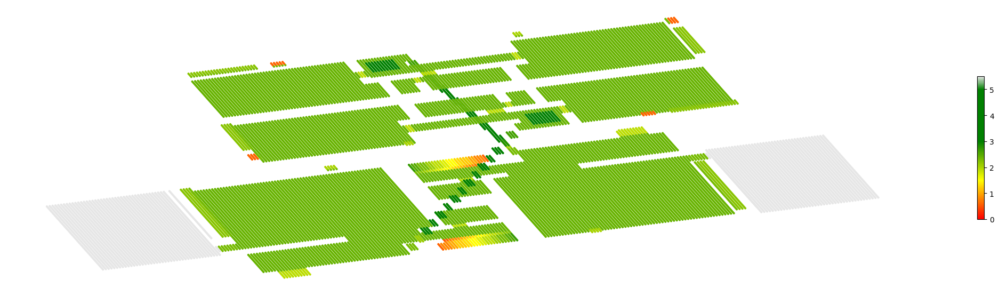
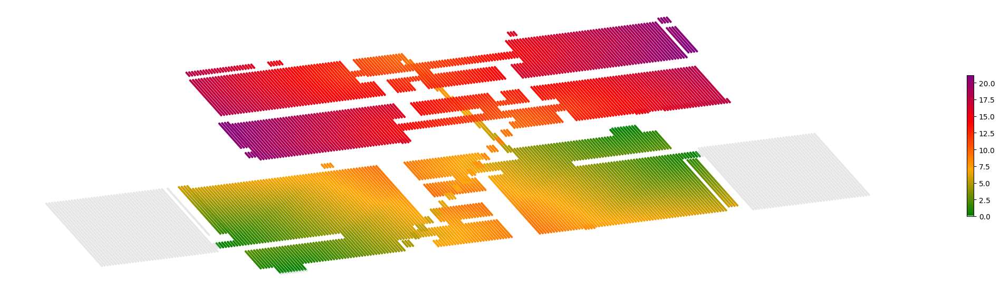
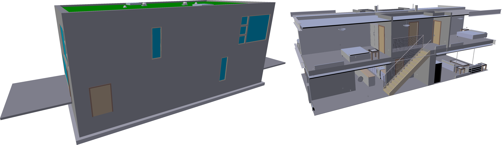

# Voxelization Toolkit
Voxelization Toolkit for (IFC) Building Models

## Introduction

(Building) models are widely different depending on modeller, phase, intended use, software application and version. Conventional BRep and Mesh geometry libraries can have robustness issues coming from floating point rounding errors and tolerances. For these reasons we provide building model analysis functionality using voxels. Comprehensive analysis regardless of modelling choices is enabled by robustly discretizing the complete building model geometry. The integer math is robust and easy to understand.

## Use cases

The toolkit presented here has been used for:

* Reliably compute volume (e.g entire building volume above and under ground; quantity calculation for non-manifold element geometries)
* Evacuation analysis (providing a length to nearest exit for every reachable place in the model; taking into account obstacles)
* Building code compliance (e.g of space dimensions taking into account contained elements)
* Safety analysis (by analysing reachable space and fall hazards)
* Detection of exterior elements (by calculating interior volume using neighbour traversal)
* Model conversion (e.g for acoustic analysis - eroding small elements - using PCA to export slanted surfaces derived from voxel grid)
* ...

## Examples

Three examples (including visualization) are elaborated in python code in `./python/voxec`

#### Headroom height

Calculate headroom height in the model taking all geometric elements into account



#### Evacuation distance

Calculate distance to the exterior for any point in the model taking into account obstacles



#### Exterior elements

Geometricaly assess exterior elements on multi-aspect models as BIM authoring tools often have erroneous IsExternal properties specified.



## Installation

The `voxec(.exe)` runtime interpreter can be installed using the Anaconda (conda) package manager from the ifcopenshell channel.

```
conda install -c conda-forge ifcopenshell=v0.7.0
conda install -c ifcopenshell voxelization_toolkit
```

## Usage

Recommended usage is using the `voxec` runtime interpreter, which takes an input "voxelfile" which describes a series of commands. The grammar of such as voxelfile is:

```
iden = alpha (alnum | '_')*
statement = iden '=' function_call
quoted_string = '"' (char - '"')* '"'
sequence = '{' quoted_string? (',' quoted_string)* '}'
value = strict_double | int_ | quoted_string | iden | sequence
function_arg = iden '=' value
function_args = function_arg? (',' function_arg)*
function_call = iden '(' function_args ')'
argument_list = iden? (',' iden)*
function_def = "function" iden '(' argument_list ')' statement* "return" iden
start = (statement | function_def)*
```

For example:

```
file = parse("duplex.ifc")
slabss = create_geometry(file, include={"IfcSlab"})
roofss = create_geometry(file, include={"IfcRoof"})
slabs = voxelize(slabss)
roofs = voxelize(roofss)
floors_surface = subtract(slabs, roofs)
floor_volume = volume2(floors_surface)
floors = union(floors_surface, floor_volume)
floors_surface = collapse(floors, 0, 0, -1)
num = count(floors_surface)
```

A list of available commands is provide below.

## Available commands:

### assert()

Asserts that a certain the voxel grid or integer value specified in `input` represents a count greater than zero.

name|required|type
---|---|---
input|Y|voxels,integer

### collapse()

Reduce the volume of components along the direction vector <dx dy dz> to 1. Useful to calculate floor area by eliminating the thickness of floor slabs. This is the reverse of extrusion.

name|required|type
---|---|---
input|Y|voxels
dx|Y|integer,real
dy|Y|integer,real
dz|Y|integer,real
until|n|voxels
max|n|integer


### collapse_count()

Same as collapse() but return voxel grid of type uint32 with the number of collapsed voxels.

name|required|type
---|---|---
input|Y|voxels
dx|Y|integer,real
dy|Y|integer,real
dz|Y|integer,real
until|n|voxels
max|n|integer


### component_foreach()

Apply a function to each connected component individually

name|required|type
---|---|---
input|Y|voxels
function|Y|string
argument|Y|string


### constant_like()

Return a constant voxel grid of type `type` with value `value` with the same dimensions as `input`.

name|required|type
---|---|---
input|Y|voxels
value|Y|integer
type|n|string


### copy()

Return a copy of `input`, optionally with a different type.

name|required|type
---|---|---
input|Y|voxels
type|n|string


### count()

Count the number of non-zero voxels in `input`. This is information is present as meta-data on most voxel region types.

name|required|type
---|---|---
input|Y|voxels


### count_components()

Count the number of connected components in `input`.

name|required|type
---|---|---
input|Y|voxels

### count_neighbours()

Returns a new u32 grid with for every voxel the number of neighbours counted, with 6 or 26 for `connectivity`.

name|required|type
---|---|---
input|Y|voxels
connectivity|Y|integer

### create_geometry()

Create geometry from a set of IFC building model inputs (uses IfcOpenShell, result is a set of OpenCASCADE solids)

name|required|type
---|---|---
input|Y|ifcfile
include|n|sequence
exclude|n|sequence
optional|n|integer
only_transparent|n|integer
only_opaque|n|integer


### describe_components()

Print information on the connected components in `input`. Writes JSON information to a new file in `ouput_path`.

name|required|type
---|---|---
output_path|Y|string
input|Y|voxels


### describe_group_by()

Takes the component labels in `groups` and print information on the components selected by these individual labels in `input`. Writes JSON information to a new file in `ouput_path`.

name|required|type
---|---|---
output_path|Y|string
input|Y|voxels
groups|Y|voxels
use_bits|n|integer
conserve_memory|n|integer
only_counts|n|integer

### dump_surfaces()

Revoxelize `input_surfaces` and dump information to `output_path` when intersecting with `input_voxels`

name|required|type
---|---|---
input_voxels|Y|voxels
input_surfaces|Y|surfaceset
output_path|Y|string

### dimensionality_estimate()

Use PCA to estimate the local dimensionality for individual voxels. The three eigen values that are returned in a new grid describe the degree of variance along the principal axes. When these eigenvalues are roughly equal the voxel van be considered part of a 3d component. If there is one eigenvalue considerably greater than the other two, it constitutes a part of 1d component. Etc.

For each individual voxel a neighbourhood consisting of voxels within a topological distance of `max_depth` voxels is formed. For voxels on the edge of a component this means an assymetric neighborhood is formed, because the neighborhood extends inwards into the component, but outwards there are no neighbours. This affects the distribution of eigenvalues. In order to get a more uniform distribution of eigenvalues within a component, the `reposition=1` can be used, which first takes a neighborhood of `max_depth` voxels and then takes the mean of that to be the seed of a second neighborhood traversal of `max_depth_2` voxels. This effectively moves the center of the neighborhood inwards.

name|required|type
---|---|---
input|Y|voxels
max_depth|n|integer
max_depth_2|n|integer
distance_2|n|real
neighbourhood_size|n|integer
reposition|n|integer

### export_csv()

Exports a voxel grid to CSV.

name|required|type
---|---|---
input|Y|voxels
filename|Y|string


### export_ifc()

Exports a subset of the IFC model in `input` depending on the whether a revoxelization of `input_surfaces` (previously computed from `input`) intersects with `input_voxels`.

name|required|type
---|---|---
input|Y|ifcfile
input_voxels|Y|voxels
input_surfaces|Y|surfaceset
output_path|Y|string


### export_json()

Same as `export_ifc()`, but don't serialize a full IFC model but rather element identifiers.

name|required|type
---|---|---
input|Y|ifcfile
input_voxels|Y|voxels
input_surfaces|Y|surfaceset
output_path|Y|string


### export_point_cloud()

Similar to export_csv() but a different format.

name|required|type
---|---|---
input|Y|voxels
filename|Y|string


### exterior()

Computes the exterior of `input` by starting traversal from a point outside of the bounding box of `input`.

name|required|type
---|---|---
input|Y|voxels

### fill_gaps()

Fills 1-sized holes in `input`.

name|required|type
---|---|---
input|Y|voxels


### fill_volume()

Fills the interior volume of the bounded region in `input`.

name|required|type
---|---|---
input|Y|voxels


### filter_attributes()

Filters the ifc elements in `input` based on attribute values. Use keyword arguments to specify attribute names and values.

name|required|type
---|---|---
input|Y|ifcfile


### filter_properties()

Filters the ifc elements in `input` based on property values. Use keyword arguments to specify property names and values.

name|required|type
---|---|---
input|Y|ifcfile

### free()

Frees storage associated with a voxel grid. Use with caution.

name|required|type
---|---|---
input|Y|voxels

### greater_than()

Returns a binary voxel grid where the uint32 values in `input` are greater than `rhs`.

name|required|type
---|---|---
input|Y|voxels
rhs|Y|integer


### halfspace()

Create a half space (size provided by `input`) based on the plane equation `a b c d`.

name|required|type
---|---|---
input|Y|voxels
a|Y|real
b|Y|real
c|Y|real
d|Y|real


### intersect()

Returns the intersection of `a` and `b`.

name|required|type
---|---|---
a|Y|voxels
b|Y|voxels
if_non_empty|n|integer


### invert()

Returns the inversion of `input`. Should only be used on binary voxel grids.

name|required|type
---|---|---
input|Y|voxels


### json_stats()

Writes json statistics of currently defined variables (potentially filtered by `variables`).

name|required|type
---|---|---
output_path|Y|string
variables|n|sequence

### keep_components()

Keep only the connected components in `input` with size greater or equal to `min_size`.

name|required|type
---|---|---
input|Y|voxels
min_size|Y|integer


### keep_neighbours()

Keeps only voxels with the `num_neighbours` amount of neighbours. Connectivity should be 6 or 26.

name|required|type
---|---|---
input|Y|voxels
num_neighbours|Y|integer
connectivity|Y|integer


### less_than()

Returns a binary voxel grid where the uint32 values in `input` are less than `rhs`.

name|required|type
---|---|---
input|Y|voxels
rhs|Y|integer


### local_move()

Move the created IFC geometry along their local coordinate axis, can be used to create thicker volumes for doors or windows for example.

name|required|type
---|---|---
input|Y|surfaceset
dx|Y|real
dy|Y|real
dz|Y|real
VOXELSIZE|n|real


### local_sweep()

Sweeps the created IFC geometry along their local coordinate axis, can be used to create thicker volumes for doors or windows for example.

name|required|type
---|---|---
input|Y|surfaceset
dx|Y|real
dy|Y|real
dz|Y|real
VOXELSIZE|n|real


### mesh()

Create a OBJ triangle mesh from the voxel interior. When `use_value` is specified create interfaces between segments with different values. When `with_components` is specified numeric identifiers are assigned to the connected components.

name|required|type
---|---|---
input|Y|voxels
filename|Y|string
use_value|n|integer
with_components|n|integer
groups|n|voxels
with_vertex_normals|n|integer

### normal_estimate()

Perform PCA normal estimatation on the voxel grid in `input`. `max_depth` specifies the topological connection threshold of the neighbours to incorporate in the PCA.

name|required|type
---|---|---
input|Y|voxels
max_depth|Y|integer


### offset()

Returns a new voxel grid where neighbours of voxels in `input` are set.

name|required|type
---|---|---
input|Y|voxels


### offset_xy()

Returns a new voxel grid where XY-neighbours of voxels in `input` are set.

name|required|type
---|---|---
input|Y|voxels
d|Y|integer,real


### outmost()

Returns the outmost (rightmost actually) connected component in `input`.

name|required|type
---|---|---
input|Y|voxels


### parse()

Parse the IFC building model using IfcOpenShell

name|required|type
---|---|---
input|Y|string


### plane()

Create a 1-thickness plane from the plane equation in `a b c d`.

name|required|type
---|---|---
input|Y|voxels
a|Y|real
b|Y|real
c|Y|real
d|Y|real


### print_components()

Print information on the connnected components in `input`.

name|required|type
---|---|---
input|Y|voxels


### print_values()

Print information on the values in `input`.

name|required|type
---|---|---
input|Y|voxels


### repeat_slice()

name|required|type
---|---|---
input|Y|voxels
axis|Y|integer
location|Y|real
repetitions|Y|integer


### resample()

Resample the voxel grid in `input` using an integer factor. Use negative values for downsampling.

name|required|type
---|---|---
input|Y|voxels
factor|Y|integer


### segment()

Apply segmentation using a voxel grid obtained from `normal_estimate()`.

name|required|type
---|---|---
input|Y|voxels
angular_tolerance|n|real
max_curvature|n|real


### set()

Set an individual voxel on grid in `input`.

name|required|type
---|---|---
x|Y|integer,real
y|Y|integer,real
z|Y|integer,real
input|n|voxels

### shift()

Shift the voxels in `input` along the direction vector `dx dy dz`.

name|required|type
---|---|---
input|Y|voxels
dx|Y|integer,real
dy|Y|integer,real
dz|Y|integer,real
until|n|voxels
max|n|integer


### subtract()

Subtract `b` from `a`.

name|required|type
---|---|---
a|Y|voxels
b|Y|voxels
if_non_empty|n|integer


### sweep()

Sweeps the voxels in `input` along the direction vector `dx dy dz`.

name|required|type
---|---|---
input|Y|voxels
dx|Y|integer,real
dy|Y|integer,real
dz|Y|integer,real
until|n|voxels
max|n|integer


### traverse()

Perform traversal on the voxels in `input` starting from the selection in `seed`, optionally with along a maximum number of voxels in `depth`. Operates on 6 or 26 connectivity. Returns a binary voxel grid by default but can also return uint32, in which case, when using 26-connectedness, values are multiples of [10, 10 * sqrt(2), 10 * sqrt(3)].

name|required|type
---|---|---
input|Y|voxels
seed|Y|voxels
depth|n|integer,real
connectedness|n|integer
type|n|string


### union()

Returns the union of `a` and `b`.

name|required|type
---|---|---
a|Y|voxels
b|Y|voxels
if_non_empty|n|integer


### volume()

`DEPRECATED use volume2()` Returns the bounded interior region of `input`.

name|required|type
---|---|---
input|Y|voxels


### volume2()

Returns the bounded interior region of `input`. Calculated as the inversal of the exterior.

name|required|type
---|---|---
input|Y|voxels


### voxelize()

Voxelizes the geometry obtained from an IFC input file. Use `method='volume'` to have individual element interiors filled (computationally more complex).

name|required|type
---|---|---
input|Y|surfaceset
VOXELSIZE|n|real
type|n|string
method|n|string


### zeros()

Return a new empty voxel grid filled with zeros, same size as `input`.

name|required|type
---|---|---
input|Y|voxels
